# 🚀 Intelligent Goal & Task Management App

doBy -  An AI-powered Android application for goal and task management  
featuring voice-to-task processing, offline-first architecture, analytics, and gamification.

---

## 📌 About the Project

This is not just a typical todo list.

The application helps users:

- Set long-term goals and break them into actionable tasks
- Receive flexible deadline-based notifications
- Analyze productivity through visual analytics
- Create tasks using voice with automatic AI structuring
- Sync data across multiple devices with cloud support

The project focuses on clean architecture, reactive state management, offline support, and real-world production challenges.

---

# 📱 Screenshots

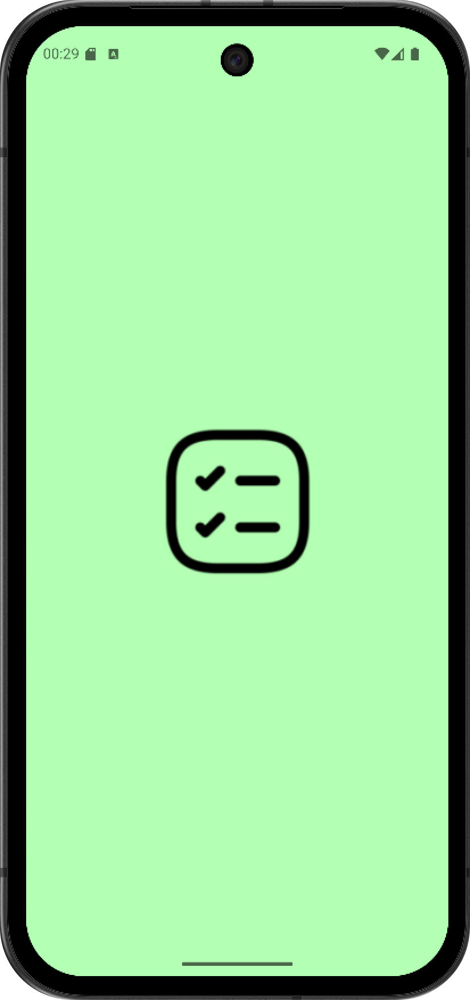/

## 🎯 Main screen

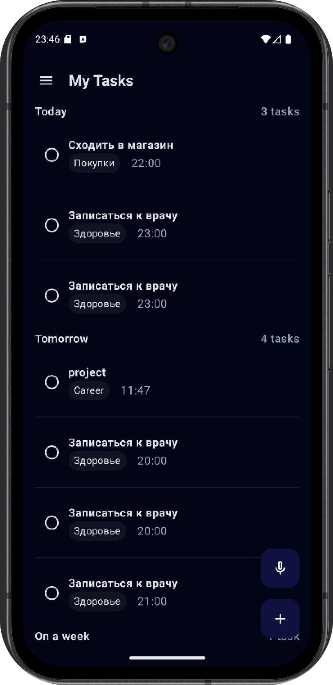/
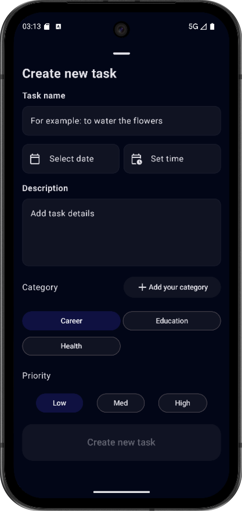/

## 🎯 Goals

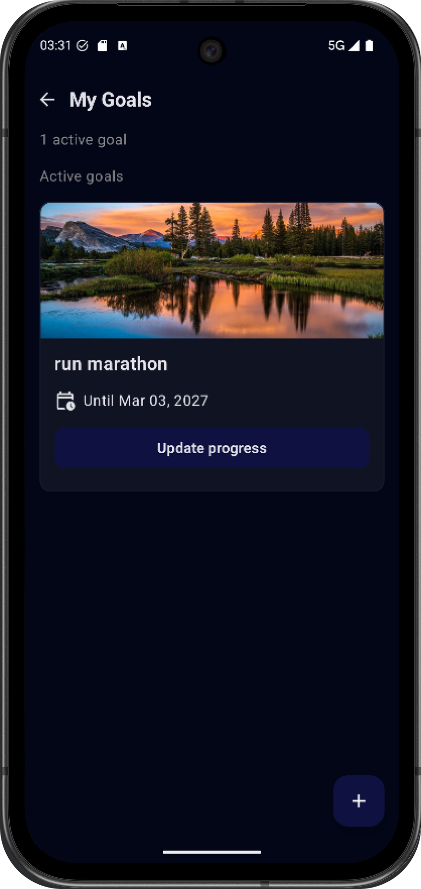/
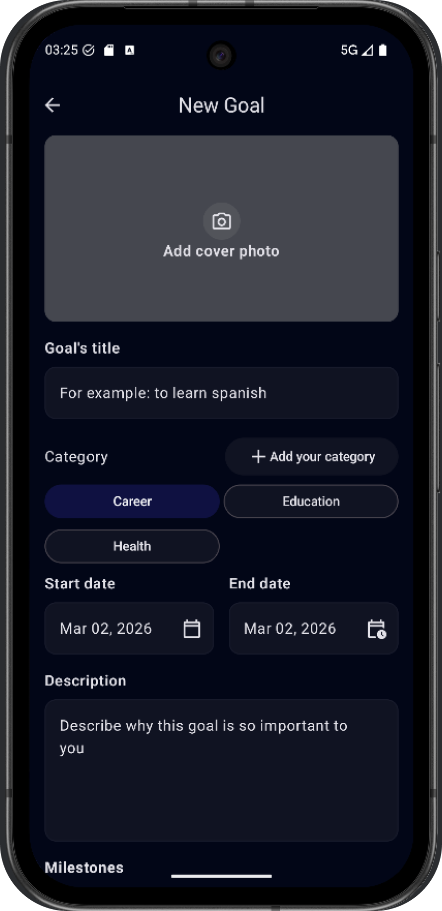/

---

## Authentification
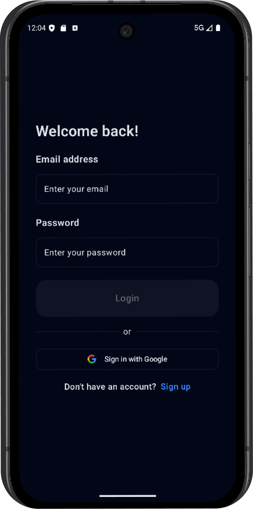/
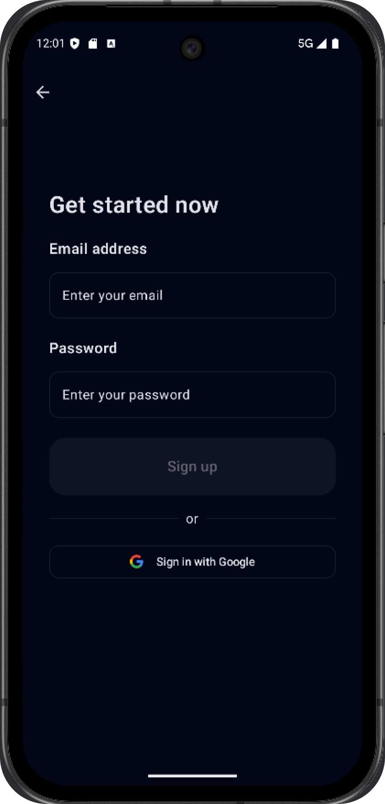/
---

## 📊 Analytics

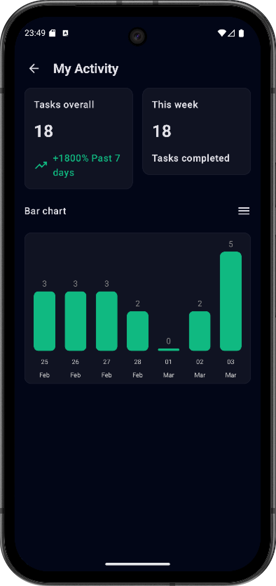/
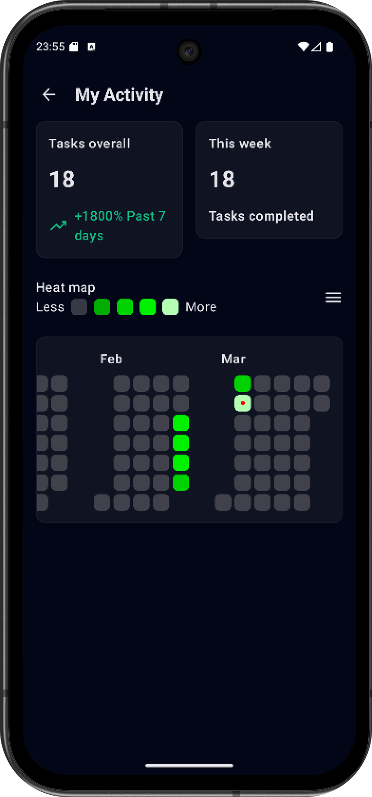/

---

## 🏆 Achievements

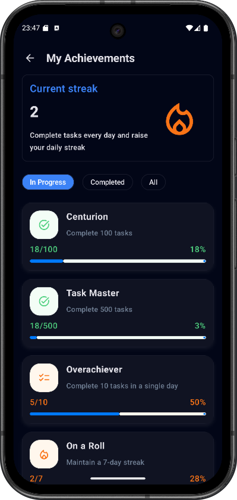/

## Settings

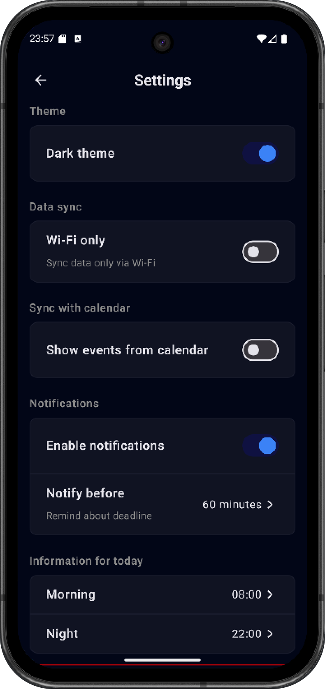/

## Recently completed

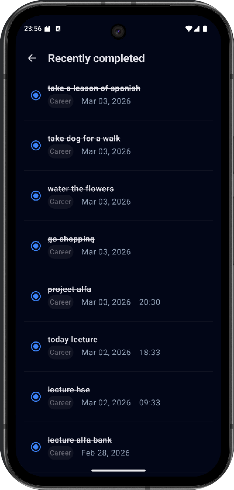/

---
# ✨ Core Features

## ✅ Goal & Task Management
- Full CRUD operations
- Deadline support
- Completed tasks archive with restore functionality
- Reactive UI updates

## 🔔 Smart Notification System
- Customizable reminder timing
- Exact deadline handling
- Background execution
- Doze mode compatibility

## 🎮 Gamification System
- Achievement tracking (e.g., "Complete 10 tasks")
- Streak tracking
- Automatic progress calculation

## 🎤 AI Voice Processing
- Speech-to-Text integration
- Text processing via LLM (GigaChat API, SaluteSpeechApi)
- Automatic extraction of:
    - Tasks
    - Deadlines
    - Categories
- Date normalization and validation

## 📊 Productivity Analytics
- Bar chart for completed tasks
- Yearly heatmap (similar to GitHub contribution graph)
- Scalable time range selection
- Visual productivity tracking

---

# 🏗 Architecture

The application is built using:

- Clean Architecture
- MVVM pattern
- Reactive data streams via Kotlin Flow

### Architecture Layers

- **Presentation** (Jetpack Compose + ViewModel)
- **Domain** (UseCases, business logic)
- **Data** (Repositories, local & remote data sources)

---

# 🛠 Tech Stack

### Language
- Kotlin

### UI
- Jetpack Compose
- Navigation Component

### Asynchronous Programming
- Coroutines
- Flow / StateFlow

### Dependency Injection
- Hilt

### Networking
- Retrofit
- OkHttp

### Local Storage
- Room
- DataStore

### Cloud Services
- Firebase Authentication
- Firestore

### Background Processing
- WorkManager
- AlarmManager

### Testing
- JUnit
- Kotest
- Mockito
- Compose UI Testing

---

# 🧠 Technical Challenge
## AI-Based Natural Language Processing

Challenges:
- Unstructured user speech
- Ambiguous deadlines
- Multiple date formats

Solutions:
- Prompt engineering
- Structured JSON responses from LLM
- Post-processing and date normalization
- Validation layer before database insertion
---
